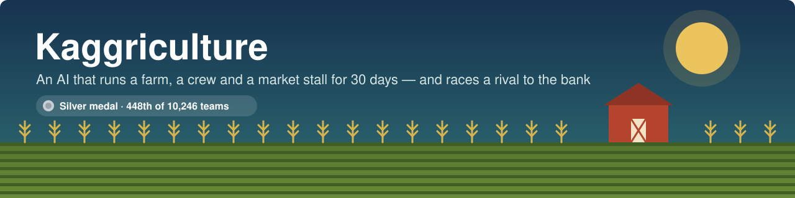
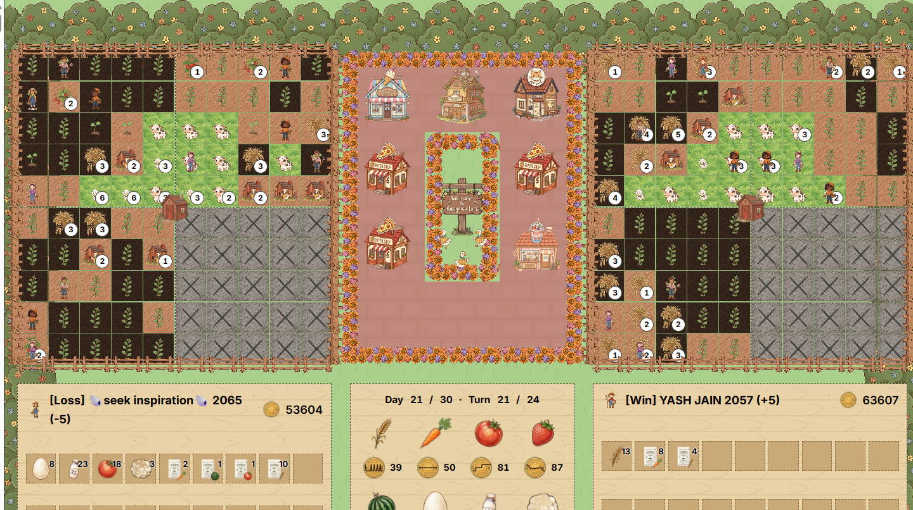
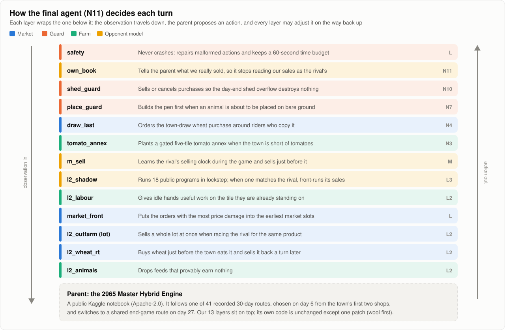
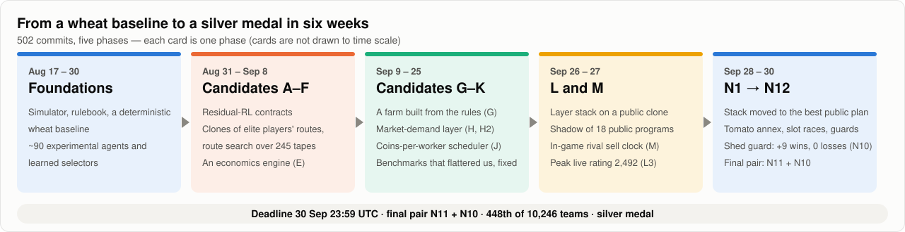
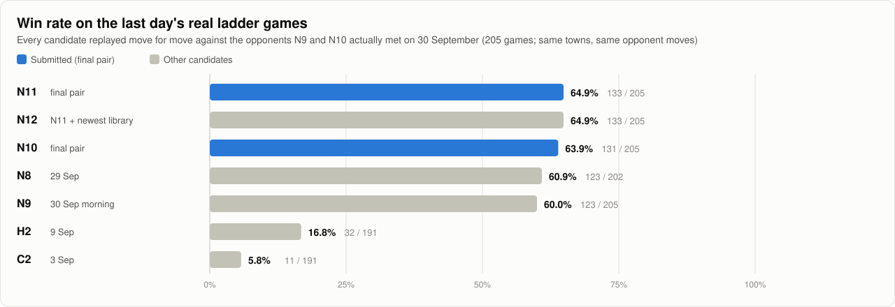

<p align="center">
  
</p>

<p align="center">
  <a href="https://www.kaggle.com/competitions/kaggriculture"></a>
  
  
  <a href="LICENSE"></a>
</p>

# Kaggriculture

My agents for **[Kaggriculture](https://www.kaggle.com/competitions/kaggriculture)**,
a Kaggle simulation competition in which two AI farmers share one town for 30
days. Each turn an agent commands its farmer and hired hands, buys land, seeds and
animals, and places up to ten orders in a market both players trade in at the
same time. After 720 turns, whoever has banked more coins wins.

- Six weeks of work: 502 commits, more than 100 agents and variants built and
  measured, 44 of them packaged and submitted to Kaggle.
- The final pair, **N11** and **N10**, are a route-following base engine
  wrapped in thirteen layers of my own design.
- On the 205 real ladder games of the last day, N11 wins **64.9%**; my best
  agent from three weeks earlier wins 16.8% of the same games.

<p align="center">
  
  <br><sub>A game from the final evaluation, on day 21 of 30. My agent is on the right; it won.</sub>
</p>

## The game in one paragraph

Each player starts with one of four 5×5 land quadrants and 3,000 coins. Crops
(wheat, carrots, tomatoes, strawberries, melons) need planting, watering and
harvesting; animals (cows, sheep, geese) need pens, feed and care. Hands are
hired daily at a rising cost. Prices are set by a shared market inventory, so
every unit either player sells pushes the price down for both, and the town's
shops eat a few units of each product every four turns. At the end of each day
everything the crew carries is dropped into a 100-unit shed, and anything over
capacity is destroyed. The full rules are in
[`docs/game/RULEBOOK.md`](docs/game/RULEBOOK.md).

## The final agent



The base engine is open-source code from the competition's public notebooks
(Apache-2.0). It follows one of 41 recorded 30-day routes, picked on day 6 from
the town's first two shops. A strong route on its own is not enough to win:
many agents on the ladder play routes like it, so games are decided by how
each turn is executed against a live opponent. That is where the thirteen
layers ([`stack/`](stack/README.md)) come in:

- **Market microstructure.** The market settles orders slot by slot, and both
  players' orders in the same slot trade at a shared price. `market_front`
  puts the orders whose price damage is largest into the earliest slots;
  `l2_wheat_rt` buys wheat just before the town eats it and sells the same
  units a turn later; `draw_last` notices rivals who imitate that trade.
- **Opponent modelling.** `l2_shadow` runs 18 public programs in lockstep with
  the game. When one reproduces the rival's moves, it knows the rival's sales
  in advance and sells first. `m_sell` learns the selling hour of rivals it
  cannot identify, and `own_book` keeps the base engine's estimate of the
  rival's sales honest.
- **Guards.** `shed_guard` stops the day-end drop from destroying goods;
  `place_guard` builds the pen before an animal is placed; `safety` makes sure
  no exception, malformed action or slow turn can forfeit a game.
- **Farm.** `l2_labour` gives idle hands useful work on their own tile;
  `tomato_annex` plants a small tomato field when the town is short;
  `l2_animals` stops feeds that earn nothing.

## How it got there



I started with a deterministic wheat farmer and grew it into about 90
experimental agents with learned selectors ([`agents/`](agents/),
[`policies/`](policies/)). In September I built route experts from top
players' recorded games, searched 245 recorded routes for the strongest, and
wrote three agents that plan from first principles: an economics engine (E), a
farm built from the rules (G) and a scheduler that prices every task in coins
per worker-turn (J) ([`candidates/`](candidates/README.md)). Measuring them on
real ladder games showed that the strongest route followers were hard to beat
on farm size alone, so in the last five days I changed strategy: keep a strong
route-following base and put the effort into what decides close games —
market timing, opponent modelling and guards. The L series built that layer
stack; the N series moved it onto the strongest base available. Every step is
recorded in [`docs/`](docs/README.md).

## Results



<details>
<summary>Table view</summary>

| Agent | Built | Games won | Win rate |
|---|---|---:|---:|
| N11 (submitted) | 30 Sep | 133 of 205 | 64.9% |
| N12 | 30 Sep | 133 of 205 | 64.9% |
| N10 (submitted) | 30 Sep | 131 of 205 | 63.9% |
| N8 | 29 Sep | 123 of 202 | 60.9% |
| N9 | 30 Sep | 123 of 205 | 60.0% |
| H2 | 9 Sep | 32 of 191 | 16.8% |
| C2 | 3 Sep | 11 of 191 | 5.8% |

Each agent was replayed move for move against the opponents N9 and N10 met on
the ladder on 30 September: same towns, same opponent moves. A submission
replays its own live games exactly (all 35 of N10's checked games matched
Kaggle to the coin), so every agent is compared on identical games.
</details>

## Measuring a moving target

The hardest problem in this competition was not building an agent but knowing
whether it was good. A rating, or a win rate on a test panel, only says how an
agent did against the opponents it met at that moment, and those opponents
kept getting stronger: teams submitted new versions every day and popular
public programs were republished with improvements. An agent that was winning
one week could be ordinary the next without a single line of its code
changing.

| Agent | Measured in its own time | Same agent on the last day's 205 games |
|---|---|---:|
| C2 (3 Sep) | won 69 of 80 games on its test panel | 5.8% |
| H2 (mid-Sep) | rated 2,323.7 after 114 ladder games, winning 54% against opponents averaging about 2,354 | 16.8% |

The ground moved even within days:

- On 27 September, L3 won 86% of its games against the 2,300–2,400 band. That
  band then moved to a new version of a popular public program, and the next
  day the agents built on L3's base won 49–58% there.
- Ratings across the ladder fell 40–90 points a day as stronger agents
  arrived, while retired submissions kept the score they had when they
  stopped playing. L3's frozen 2,492 looked far better than N9's live 2,146,
  yet replayed on the same 98 recent games, N9 won 60 and L3 won 39.
- A local benchmark against the built-in opponents flattered my agents by
  about 40 percentage points, and a panel of elite replays measured opponents
  my agents rarely met.

So I stopped trusting any number that was not measured on the current field,
and three habits came out of it:

1. **Pinned replays of my newest ladder games.** I downloaded the games my
   live agents had just played, replayed each opponent's recorded moves on the
   same seed, and put a candidate in my seat. Every candidate, old or new, was
   compared on identical, current games.
2. **Re-measure the old agents on the same games.** A new agent was promoted
   only if it beat the previous best on those games, never by comparing a
   fresh score with an old one.
3. **Keep the opponent model current.** The public programs the shadow layer
   simulates were refreshed as new versions appeared, up to the final day.

The target never stood still, so neither could the agents: each week's best
agent became the next week's baseline to beat, which is how C and H led to L,
and L led to the N series.

## What I learned

1. **Read the engine, not just the rules.** The day-end drop into the shed
   silently destroyed goods in about 90% of my games, around 400 coins a
   game, mostly on days 23–28. Fixing it (N10) won 9 more games and lost
   none across 563 replayed games, the largest single gain of the final week.
2. **In a shared market, order matters as much as price.** Slot-by-slot
   settlement means the same sale earns more one slot earlier. Several layers
   exist only to win these races.
3. **Public programs are part of the field, so model them.** About one in ten
   of my opponents ran a public program unchanged, and many more ran close
   relatives. Simulating 18 of them in lockstep made those opponents
   predictable: N10 won 70 of 72 games against six popular public agents, and
   all 28 against fourteen more public programs found on the final day.
4. **Pick on one set of games, confirm on another.** A variant that looked
   +5 wins on 221 games was −6 on the next 98. Every change in the final
   agent was selected on one set and confirmed on independent ones.
5. **Where it fell short.** The teams at 2,300–2,900 build bigger farms
   sooner: three land quadrants by day 10 and far more tomatoes, eggs and
   strawberries. On the last day, 9 of my 24 losses to teams rated above
   2,150 were by 10,000–26,000 coins. Better execution cannot close that gap;
   a live planner that expands earlier would be the next step.

## Repository

```text
stack/        the final agent: thirteen layers around a route-following base (agents L to N12)
candidates/   agents A to K and the components they were built from
rl/           reinforcement-learning contracts: features, action space, rewards, rollout, replay
agents/       the August agents: a deterministic baseline grown into about 90 experimental policies
policies/     strategy interfaces and learned selectors used by agents/
core/         shared mechanics: routing and economics
research/     August analysis, counterfactual collection, evaluation and training scripts
tools/        measuring, packaging and validating (pinned replays, arena, Kaggle fetchers, packagers)
tests/        unit and integration tests (684)
models/       small model files used by agents/ and policies/
submissions/  the exact files uploaded to Kaggle, one folder per agent
docs/         rules, research, the working journal and figures
```

More detail: [`docs/REPOSITORY_MAP.md`](docs/REPOSITORY_MAP.md).
Replay datasets, downloaded ladder games and the public programs used for
evaluation are not committed (they can contain Kaggle Competition Data); the
fetchers in [`tools/data/`](tools/data/) recreate them.

## Quick start

The project uses Python 3.12 and the official simulator,
`kaggle-environments` 1.32.7. Install it without its other games' extras:

```powershell
conda create --prefix .conda python=3.12 pip -y
./.conda/python.exe -m pip install -r requirements-simulator.txt
./.conda/python.exe -m pip install --no-deps kaggle-environments==1.32.7
./.conda/python.exe -m pip install pytest
```

Play a game, benchmark an agent, and run the tests:

```powershell
./.conda/python.exe run_match.py --steps 720 --opponent starter --seed 7 --html artifacts/seed-7.html
./.conda/python.exe benchmark.py --opponent starter --seed-start 0 --seed-count 10 --steps 720 --output artifacts/benchmarks/baseline.json
./.conda/python.exe -m pytest tests rl/tests -q
```

The tests check the agents' decision rules, the market and economics models,
the replay tools, and that every package builder produces a standalone file
Kaggle can load. Some of them rebuild the August packages in place; `git
restore submissions` puts the committed files back.

Rebuild a final submission. The base engine and the opponent library are
public programs that are not committed here, so extract them from their
notebooks into `rl/public/` first (`tools/data/extract_notebook_agents.py`):

```powershell
./.conda/python.exe -m tools.packaging.build_final N11            # -> build/N11/main.py
./.conda/python.exe -m tools.packaging.build_final N10 --verify   # + 8 games vs the local factory
```

## Acknowledgements

I learned a great deal from the Kaggriculture community's public notebooks.
Reading, running and measuring them against my own agents taught me how the
game is really played and shaped most of my approaches. Thank you in
particular to:

- [haideptry](https://www.kaggle.com/haideptry), for *The 2965 Master Hybrid
  Engine*, the open-source base engine of my final agent
- [haodou092](https://www.kaggle.com/haodou092), for the *Harvest Ledger*
- [Ahmed Berat Özer](https://www.kaggle.com/ahmedberatozer), for the V-series
  of agents and their detailed write-ups
- [Thomas Tschinkel](https://www.kaggle.com/thomastschinkel), for the
  public-state routers and *The 2945 Farm*
- [tetsutani](https://www.kaggle.com/tetsutani), for demand-preserving sale
  timing
- [yhay81](https://www.kaggle.com/yhay81), for the shop routers and replay tools
- [arsgorynich](https://www.kaggle.com/arsgorynich),
  [statma](https://www.kaggle.com/statma) and
  [Dmitrii Gluzdov](https://www.kaggle.com/dmitriigluzdov), for the herd-safe
  agents
- [hosen42](https://www.kaggle.com/hosen42),
  [guruprasaathas111](https://www.kaggle.com/guruprasaathas111),
  [nathanjacob](https://www.kaggle.com/nathanjacob),
  [aurax7](https://www.kaggle.com/aurax7),
  [destbreso](https://www.kaggle.com/destbreso) and everyone else who
  published their work

Code from these notebooks is shared under Apache-2.0. Every file in this
repository that includes some of it keeps its original licence notices.

## Licence

[Apache-2.0](LICENSE). See [`NOTICE`](NOTICE).

Built by **Yash Jain** ([@YAshhh29](https://github.com/YAshhh29)).
