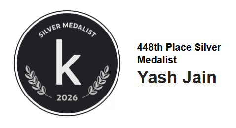

<p align="center">
  
</p>

<p align="center">
  <a href="https://www.kaggle.com/competitions/kaggriculture"></a>
  
  
  
</p>

# Kaggriculture

My agent for **[Kaggriculture](https://www.kaggle.com/competitions/kaggriculture)**,
a Kaggle simulation competition in which two AI farmers share one town for 30
days. Each turn an agent commands its farmer and hired hands, buys land, seeds and
animals, and places up to ten orders in a market both players trade in at the
same time. After 720 turns, whoever has banked more coins wins.

<table>
  <tr>
    <td width="42%" align="center">
      
    </td>
    <td>
      <h3>448th of 10,246 teams — silver medal</h3>
      <ul>
        <li>Top 4.4% of the final leaderboard</li>
        <li>Six weeks, 502 commits, more than 100 agents and variants built and measured, 44 of them packaged for Kaggle</li>
        <li>Final pair: <b>N11</b> and <b>N10</b>, a public route-following engine wrapped in thirteen of my layers</li>
        <li>On the 205 real ladder games of the last day, N11 wins <b>64.9%</b>; my best agent from three weeks earlier wins 16.8% of the same games</li>
      </ul>
    </td>
  </tr>
</table>

<p align="center">
  
  <br><sub>A game from the final evaluation, on day 21 of 30. My agent is on the right; it won.</sub>
</p>

## The game in one paragraph

Each player starts with one of four 5×5 land quadrants and 3,000 coins. Crops
(wheat, carrots, tomatoes, strawberries, melons) need planting, watering and
harvesting; animals (cows, sheep, geese) need pens, feed and care. Hands are
hired daily at a rising cost. Prices are set by a shared market inventory, so
every unit either player sells pushes the price down for both, and the town's
shops eat a few units of each product every four turns. At the end of each day
everything the crew carries is dropped into a 100-unit shed, and anything over
capacity is destroyed. The full rules are in
[`docs/game/RULEBOOK.md`](docs/game/RULEBOOK.md).

## The final agent


The parent is a public notebook, the *2965 Master Hybrid Engine* (Apache-2.0).
It does not plan; it follows one of 41 recorded 30-day routes taken from strong
games, picked on day 6 from the town's first two shops. Many ladder agents run
this program or one of its relatives, so it is a strong but common base.
Everything that made my agent different sits in thirteen layers around it
([`stack/`](stack/README.md)):

- **Market microstructure.** The market settles orders slot by slot, and both
  players' orders in the same slot trade at a shared price. `market_front`
  puts the orders whose price damage is largest into the earliest slots;
  `l2_wheat_rt` buys wheat just before the town eats it and sells the same
  units a turn later; `draw_last` notices rivals who copy that trade.
- **Opponent modelling.** `l2_shadow` runs 18 public programs in lockstep with
  the game. When one reproduces the rival's moves exactly, it knows the
  rival's sales in advance and sells first. `m_sell` learns the selling hour
  of rivals it cannot identify.
- **Guards.** `shed_guard` stops the day-end drop from destroying goods;
  `place_guard` builds the pen before an animal is placed; `safety` makes sure
  no exception, malformed action or slow turn can forfeit a game.
- **Farm.** `l2_labour` gives idle hands useful work on their own tile;
  `tomato_annex` plants a small tomato field when the town is short;
  `l2_animals` stops feeds that earn nothing.

## How it got there


I started with a deterministic wheat farmer and grew it into about 90
experimental agents with learned selectors ([`agents/`](agents/), [`policies/`](policies/)).
In September I tried clones of elite players' recorded routes, a search over
245 recorded tapes, and three agents that plan from first principles: an
economics engine (E), a farm built from the rules (G) and a scheduler that
prices every task in coins per worker-turn (J)
([`candidates/`](candidates/README.md)). None matched the public route
followers that dominated the ladder. In the last five days I stopped competing
with that code and built on top of it: the L series wrapped a public clone in
my layers, and the N series moved the same stack onto the strongest public
plan. Every step is recorded in [`docs/`](docs/README.md).

## Results


<details>
<summary>Table view</summary>

| Agent | Built | Games won | Win rate |
|---|---|---:|---:|
| N11 (submitted) | 30 Sep | 133 of 205 | 64.9% |
| N12 | 30 Sep | 133 of 205 | 64.9% |
| N10 (submitted) | 30 Sep | 131 of 205 | 63.9% |
| N8 | 29 Sep | 123 of 202 | 60.9% |
| N9 | 30 Sep | 123 of 205 | 60.0% |
| H2 | 9 Sep | 32 of 191 | 16.8% |
| C2 | 3 Sep | 11 of 191 | 5.8% |

Each agent was replayed move for move against the opponents N9 and N10 met on
the ladder on 30 September: same towns, same opponent moves. A submission
replays its own live games exactly (all 35 of N10's checked games matched
Kaggle to the coin), so every agent is compared on identical games.
</details>

## What I learned

1. **Measure on the games you actually play.** A local benchmark flattered my
   agents by about 40 percentage points, and an "elite panel" measured an
   opponent population my agents never met. The method that worked is the
   *pinned replay*: download a real ladder game, replay the opponent's
   recorded moves on the same seed, and swap a candidate into my seat. Live
   ratings move with the field; paired replays don't.
2. **Read the engine, not just the rules.** The day-end drop into the shed
   silently destroyed goods in about 90% of my games, around 400 coins a
   game, mostly on days 23–28. Fixing it (N10) won 9 more games and lost
   none across 563 replayed games, the largest single gain of the final week.
3. **In a shared market, order matters as much as price.** Slot-by-slot
   settlement means the same sale earns more one slot earlier. Several layers
   exist only to win these races.
4. **Public code is everywhere, so model it.** About one in ten of my
   opponents ran an exact copy of a public program, and many more ran close
   relatives. Simulating 18 of them in lockstep made those opponents
   predictable: N10 won 70 of 72 games against six popular public agents, and
   all 28 against fourteen more public programs found on the final day.
5. **Pick on one set of games, confirm on another.** A variant that looked
   +5 wins on 221 games was −6 on the next 98. Every change in the final
   agent was selected on one set and confirmed on independent ones.
6. **Where it fell short.** The teams at 2,300–2,900 build bigger farms
   sooner: three land quadrants by day 10 and far more tomatoes, eggs and
   strawberries. On the last day, 9 of my 24 losses to teams rated above
   2,150 were by 10,000–26,000 coins. Layers on a route follower cannot close
   that gap; a live planner that expands earlier would be the next step.

## Repository

```text
stack/        the final agent: thirteen layers around a public route follower (agents L to N12)
candidates/   agents A to K and the components they were built from
rl/           reinforcement-learning contracts: features, action space, rewards, rollout, replay
agents/       the August agents: a deterministic baseline grown into about 90 experimental policies
policies/     strategy interfaces and learned selectors used by agents/
core/         shared mechanics: routing and economics
research/     August analysis, counterfactual collection, evaluation and training scripts
tools/        measuring, packaging and validating (pinned replays, arena, Kaggle fetchers, packagers)
tests/        684 unit and integration tests
models/       small model files used by agents/ and policies/
submissions/  the exact files uploaded to Kaggle, one folder per agent
docs/         rules, research, the working journal and figures
```

More detail: [`docs/REPOSITORY_MAP.md`](docs/REPOSITORY_MAP.md).
Replay datasets, downloaded ladder games and other people's extracted programs
are not committed (they can contain Kaggle Competition Data); the fetchers in
[`tools/data/`](tools/data/) recreate them.

## Quick start

The project uses Python 3.12 and the official simulator,
`kaggle-environments` 1.32.7. Install it without its other games' extras:

```powershell
conda create --prefix .conda python=3.12 pip -y
./.conda/python.exe -m pip install -r requirements-simulator.txt
./.conda/python.exe -m pip install --no-deps kaggle-environments==1.32.7
./.conda/python.exe -m pip install pytest
```

Play a game, run the tests, and benchmark an agent:

```powershell
./.conda/python.exe run_match.py --steps 720 --opponent starter --seed 7 --html artifacts/seed-7.html
./.conda/python.exe -m pytest tests rl/tests -q
./.conda/python.exe benchmark.py --opponent starter --seed-start 0 --seed-count 10 --steps 720 --output artifacts/benchmarks/baseline.json
```

Rebuild a final submission. The parent and the opponent library are other
people's public programs, so extract them from their notebooks into
`rl/public/` first (`tools/data/extract_notebook_agents.py`):

```powershell
./.conda/python.exe -m tools.packaging.build_final N11            # -> build/N11/main.py
./.conda/python.exe -m tools.packaging.build_final N10 --verify   # + 8 games vs the local factory
```

Some packaging tests rebuild the August packages in place; `git restore
submissions` puts the committed files back.

## Credits

The final agents build on public Kaggle notebooks shared under Apache-2.0, with
their notices kept inside every package that embeds them. The parent is
*The 2965 Master Hybrid Engine* (haideptry). The opponent library includes
programs by haodou092 (harvest-ledger), Ahmed Berat Özer, Thomas Tschinkel,
statma, arsgorynich, hosen42, Dmitrii Gluzdov, guruprasaath and others, and
Agent A started from tetsutani's public build. Thank you to everyone who
published their work.

Built by **Yash Jain** ([@YAshhh29](https://github.com/YAshhh29)).
