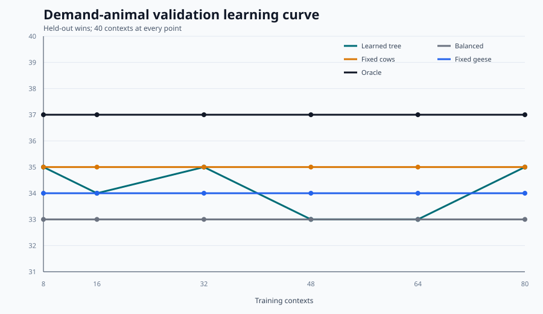

# Demand-Animal Learning Curve

The day-6 contextual bandit chooses one of three deterministic expansion plans:

- balanced: 6 cows / 6 sheep;
- cow-biased: 8 cows / 4 sheep;
- goose-biased: 6 cows / 4 sheep / 2 geese.

It never chooses raw worker or market actions. All three arms use the same safe
scheduler and share the exact opening through day 5.

## Held-Out Results

| Training contexts | Learned | Balanced | Fixed cows | Fixed geese | Oracle |
| ---: | ---: | ---: | ---: | ---: | ---: |
| 8 | 35 | 33 | 35 | 34 | 37 |
| 16 | 34 | 33 | 35 | 34 | 37 |
| 32 | 35 | 33 | 35 | 34 | 37 |
| 48 | 33 | 33 | 35 | 34 | 37 |
| 64 | 33 | 33 | 35 | 34 | 37 |
| 80 | 35 | 33 | 35 | 34 | 37 |

The curve is not monotonically improving. The final tree ties fixed cows on
wins and trails it on mean margin, while the oracle shows two recoverable wins.
This learned selector is therefore **rejected**. More contexts alone did not
solve the feature/generalization problem.

The simpler demand heuristic is advanced separately because direct rollout,
not this tree, scored 13-7 on development, 7-3 on validation, 47-3 across five
other opponent styles, and 23-1 on untouched seeds 186-187.