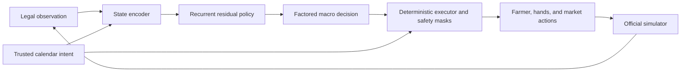

# RL Architecture

## Why Hierarchical Residual RL

Primitive Kaggriculture actions form a huge structured space. On each transition
the policy may control the farmer, a variable number of hands, and up to ten
market orders. Most random combinations are illegal, unaffordable, duplicated,
or strategically incoherent.

A neural policy should not relearn movement, basic legality, or planting-day
water from sparse terminal rewards. It should learn the decisions for which the
current calendar has no feedback:

- whether to add or remove labor;
- whether the next land purchase will repay;
- how shops and shared prices should change crop mix;
- whether animal service should be full, sparse, or abandoned;
- whether to preserve cash, pace sales, or liquidate;
- whether state drift is severe enough to trigger recovery.

## Runtime Layers

The deployed actor receives only information available in the Kaggle
observation and its own recurrent history. During training, a centralized critic
may inspect full generated simulator state, but privileged fields must never
enter the deployed actor.

## State

`features.py` currently combines:

1. normalized episode clock;
2. public opponent economy and board composition;
3. own private workload, inventory, crop stress, and service burden;
4. current market prices and unlocked-shop counts;
5. a compact summary of what the calendar intends this transition.

The vector is named and deterministic. Dataset normalization statistics belong
in a versioned model manifest, never as unexplained constants in runtime code.

Because opponent inventory and future actions are hidden, the eventual actor
should be recurrent. A GRU is a reasonable first model; a transformer is not
justified until sequence experiments show that a GRU is inadequate.

## Action

`ResidualAction` is factored into six categorical heads:

- labor;
- land;
- crop emphasis;
- animal service;
- market behavior;
- recovery.

The cross-product has many combinations, but independent heads and state-based
masks avoid enumerating one enormous flat action list. `KEEP_CALENDAR` is always
legal and is the fallback for uncertain or out-of-distribution states.

Only a deterministic executor may translate macro decisions into primitive
actions. Each new residual must receive mechanic tests and paired evaluations
before the executor enables it.

## Reward

Kaggle rating responds to wins, not coin margin. `win_first_reward` therefore
uses:

$$
r = \operatorname{sign}(c_{own} - c_{opp})
  + \lambda \tanh\left(\frac{c_{own} - c_{opp}}{S}\right),
\quad 0 \leq \lambda < 1
$$

The bounded bonus improves credit assignment without allowing a large losing
margin to look better than a narrow win. Dense shaping is intentionally absent
from phase zero. Any later shaping should be potential-based or validated
against exploitative behavior such as unsold production and pointless hiring.

## Learning Stages

### Multi-Teacher Imitation

Learn representations and legal strategic patterns from many public teams, not
only episode `99058164`. Split by team and replay date to detect memorization.

### Offline Residual Labels

At selected macro checkpoints, branch the simulator into safe candidate actions
and label which residual improves win-first utility. This turns known simulator
mechanics into supervised counterfactual training data.

### League Self-Play

Train against a mixture of:

- the frozen calendar;
- deterministic historical policies;
- elite public replay calendars;
- recent learned checkpoints;
- deliberately market-aggressive and recovery-stress policies.

Sampling only the latest policy invites cycles and catastrophic forgetting.

### Deployment Distillation

The final policy must be standalone, deterministic under fixed inputs, fast,
and packageable without network access. A small MLP or GRU with embedded weights
is preferable to shipping a large training framework.

## What Is Deliberately Missing

- No PPO/DQN dependency has been chosen.
- No residual other than `KEEP_CALENDAR` can execute.
- No dense reward shaping exists.
- No claim is made that one million games is necessary.

Those omissions are guardrails. The roadmap requires data and learning-curve
evidence before adding complexity.